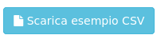

# Import


Il modulo **Import** permette di caricare dei file CSV per aggiungere dei record nei moduli _Anagrafiche, Articoli, Attività, Impianti, Listini cliente, Piano dei conti e Preventivi_


<figure><figcaption></figcaption></figure>

## ● Creazione

Per poter procedere all'importazione di dati in OpenSTAManager come prima cosa si deve selezionare il modulo interessato.

Cliccando sul tasto  sarà possibile scaricare un file CSV di esempio per l'importazione.

È possibile importare massivamente dati in diversi moduli:

* Anagrafiche (informazioni sulla creazione del file CSV su [Import anagrafiche](import-anagrafiche.md))
* Articoli (informazioni sulla creazione del file CSV su [Import articoli](import-articoli.md))
* Piano dei conti (informazioni sulla creazione del file CSV su [Import piano dei conti](import-partitario.md))
* Preventivi (informazioni sulla creazione del file CSV su [Import preventivi](import-preventivi.md))
* Impianti (informazioni sulla creazione del file CSV su [Import Impianti](import-impianti.md))
* Attività (informazioni sulla creazione del file CSV su [Import Attività](import-attivita.md))

Una volta creato il file CSV si dovrà cliccare su Sfoglia nel campo **File,** e andare a selezionarlo per il caricamento.

Cliccando ora sul tasto  apparirà questa schermata:

<figure><figcaption></figcaption></figure>

Si potrà da qui:

* definire se importare anche la prima riga del file CSV come record
* definire se aggiornare i record esistenti
* definire se creare i record mancanti
* definire la chiave primaria dei dati da importare
* mappare i campi del file CSV con quelli di OpenSTAManager

Cliccando su  il file viene importato nel modulo specificato.

#### Vedi anche:


[import-anagrafiche.md](import-anagrafiche.md)



[import-articoli.md](import-articoli.md)



[import-attivita.md](import-attivita.md)



[import-impianti.md](import-impianti.md)



[import-listini.md](import-listini.md)



[import-partitario.md](import-partitario.md)



[import-preventivi.md](import-preventivi.md)



[registrazione-movimenti-bancari.md](../../../../moduli-premium/registrazione-movimenti-bancari.md)



[importazione-articoli.md](../../../../guide/videoguide/importazione-articoli.md)

