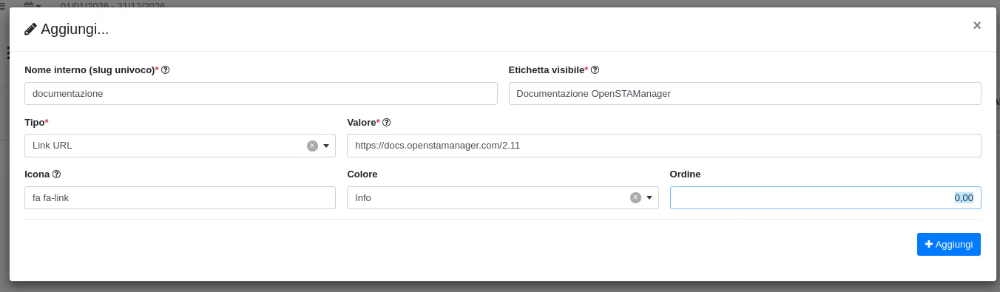

# Link navbar

Il modulo **Link navbar** permette di aggiungere **collegamenti personalizzabili al menu superiore** (navbar) del gestionale .

Questo modulo è particolarmente utile per aggiungere rapidi accessi a risorse esterne, pagine interne custom, o qualsiasi URL che l'utente desidera avere immediatamente disponibile nella barra di navigazione principale.

## Configurazione <a href="#configurazione" id="configurazione"></a>

### Aggiungere un nuovo link <a href="#aggiungere-un-nuovo-link" id="aggiungere-un-nuovo-link"></a>

Per aggiungere collegamenti personalizzati al menu superiore:

1. Clicca sul pulsante (+)
2. Inserire i seguenti dati:
   * **Nome interno**:  Slug univoco interno.
   * **Etichetta visibile**: Il testo che verrà visualizzato nella navbar
   * **Tipo:** Tipo di collegamento a scelta tra Link URL, JavaScript, Modulo o Plugin
   * **Valore**: URL per link, nome funzione globale per JavaScript, nome del modulo o plugin
   * **Icona** (opzionale): Eventuale icona associata al link
   * **Colore** (opzionale): Colore dell'icona
   * **Ordine** (opzionale): Posizione dell'icona

### Esempi di utilizzo <a href="#ejemplos-di-utilizzo" id="ejemplos-di-utilizzo"></a>

### Link a risorsa esterna <a href="#link-a-risorsa-esterna" id="link-a-risorsa-esterna"></a>

```
Etichetta: Documentazione OpenSTAManager
URL: https://docs.openstamanager.com
```

<figure><figcaption></figcaption></figure>

<figure><figcaption></figcaption></figure>

### Link a modulo <a href="#link-a-pagina-interna-custom" id="link-a-pagina-interna-custom"></a>

```
textNome: Dashboard
URL: Dashboard
```

<figure><figcaption></figcaption></figure>

<figure><figcaption></figcaption></figure>

### Vantaggi <a href="#vantaggi" id="vantaggi"></a>

* **Accesso rapido**: Collegamenti immediatamente disponibili nella navbar
* **Flessibilità**: Supporta qualsiasi tipo di URL (interno, esterno, protocollo custom)
* **Nessuna modifica al codice**: Configurazione completa tramite interfaccia grafica
