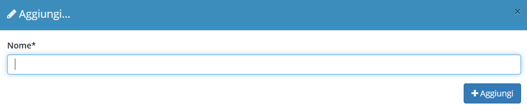

# 🗣 Utenti e permessi


Il modulo **Utenti e permessi** permette di assegnare determinati utenti ad un gruppo, concedendogli dei privilegi.


.png>)

## ➕ Creazione

Per creare una nuova tipologia di Utenti in si dovrà cliccare sul tasto (+).

Andrà qui inserito il nome della nuova tipologia di utenti.

## 🖌️ Modifica

Cliccando sul record da modificare si aprirà la schermata di dettaglio, da cui sarà possibile modificare:

* Utenti che appartengono a questa categoria (con possibilità di crearli al momento)
* Permessi clienti nella categoria

.png>)

Per creare un nuovo utente a cui assegnare la tipologia utenti appena creata, si dovrà cliccare su Aggiungi utente.

Si aprirà quindi la seguente schermata in cui compilare i campi:

* Foto utente
* Username
* Email
* Anagrafica collegata
* Sede
* Password

Cliccare su Aggiungi per creare l'utente.

.png>)

Successivamente, dal modulo viste, sarà possibile impostare la visualizzazione di determinati campi nei vari moduli, ristretta a una determinata categoria di utenti.
