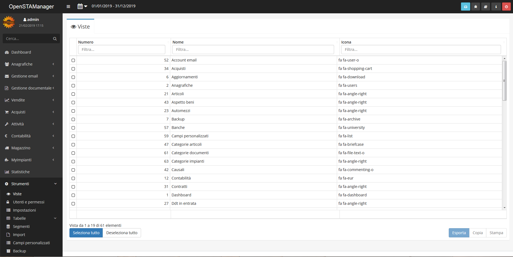
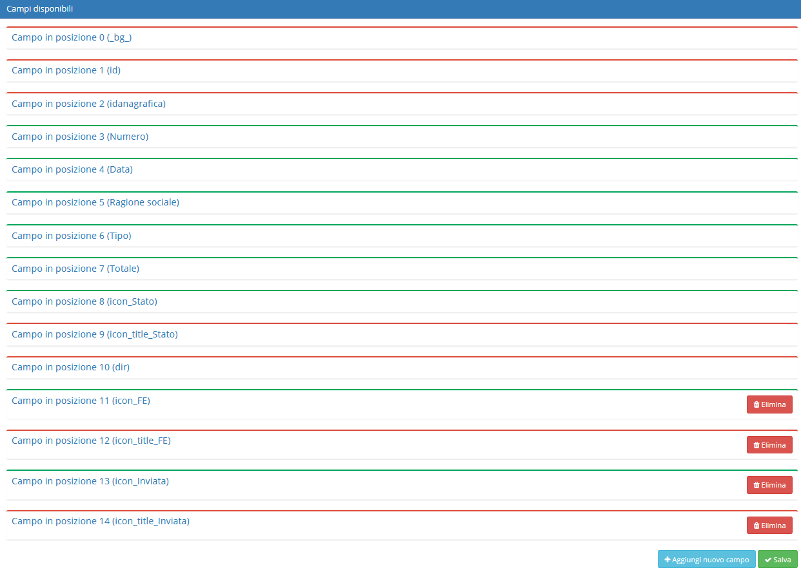

# 👀 Viste


Il modulo **Viste** permette di apportare delle modifiche alle tabelle contenenti i dati di ciascun modulo.


## 🖌️ Modifica

Cliccando sul record da modificare si aprirà la schermata di dettaglio, in cui si potranno notare diverse sezioni:

* Opzioni generali
* Campi disponibili
* Ordine di visualizzazione

### 🔨 Opzioni generali

Grazie a **Opzioni generali** è possibile modificare diversi campi, quali:

* Nome del modulo (modificare il nome che identifica il modulo)
* Query personalizzata (scrivere una query in sostituzione a quella di default)

Nelle query è possibile utilizzare dei segnaposto che verranno sostituiti come fossero delle variabili:

* **|select|**: viene sostituito con la lista dei campi da visualizzare definiti sotto
* **|date\_period(co\_documenti.data)|**: viene sostituito con "AND WHERE co\_documenti.data BETWEEN "data\_inizio" AND "data\_fine". "data\_inizio" e "data\_fine" vengono valorizzati in base al filtro di date selezionabile dal menu in alto a sinistra\
  \_\_.png>)\\
* **1=1**: è necessario specificarlo subito dopo il WHERE per far sì che venga sostituito automaticamente con i filtri che l'utente digita nel modulo. In questo modo il sistema sa dove innestare i vari filtri tramite WHERE
* **2=2**: è come 1=1 ma funzione sulla clausola HAVING, utile per le ricerche tramite HAVING

### 🔨 Campi disponibili

Nella sezione **Campi disponibili** è possibile cambiare:

* Gruppi con accesso (gruppi e utenti in grado di visualizzare quel campo)
* Visibilità (stato del campo, visualizzabile oppure nascosto)

Cliccando sopra un _record_ sono presenti 4 campi selezionabili:

* Ricercabile (indica se il campo è ricercabile)
* Ricerca lenta (selezionabile per indicare se la ricerca di quel campo è lenta)
* Sommabile (se il campo è da sommare a fine tabella)
* Formattabile (se formattare automaticamente il campo, ad esempio visualizzare la data nel formato italiano, inserire i separatori di decimali o migliaia, ecc...)
* Abilitare o disabilitare l'utilizzo dell'HTML nel campo

 (1) (1).png>)

### 🔨 Ordine di visualizzazione

Nella sezione **Ordine di visualizzazione** si può cambiare l'ordine dei campi trascinandoli:

### 🔽 Esempi di personalizzazione viste


[formattazione-celle.md](../../../guide/esempi/formattazione-celle.md)

