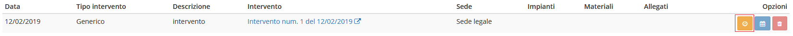

# 📅 Pianificazione attività

## 🗓️ Pianificazione attività


Il plugin **Pianificazione attività** è una componente del modulo **Contratti** dedicata alla completa gestione della pianificazione delle attività (_promemoria_) relative ai contratti registrati all'interno di OpenSTAManager.


.png>)

Da questo plugin è possibile pianificare dei promemoria o delle attività da effettuare entro determinate scadenze.


Per poter far ciò, il contratto deve rispettare certe condizioni:

* Le date di accettazione e conclusione sono state specificate
* Lo stato selezionato deve essere Pianificabile (In lavorazione, Fatturato, Pagato, Parzialmente fatturato).


## ➕ Creazione

Selezionando un tipo di attività e cliccando su Nuovo promemoria è possibile procedere alla creazione di un nuovo record.

Ogni promemoria può possedere articoli, spese generiche e allegati indipendenti, oltre ai campi:

* Data del promemoria
* Tipo intervento
* Sede
* Impianti a contratto
* Descrizione

## 🔃 Pianificazione ciclica

Una volta creato il promemoria, sarà possibile effettuare una pianificazione ciclica dello stesso attraverso il pulsante della relativa riga.

Si aprirà quindi una schermata riepilogativa che presenterà come ultime due sezioni queste:

* Promemoria ciclico?
* Pianificare interventi?

### 🔂 Promemoria ciclico?

La pianificazione di promemoria ciclici replicherà in modo completo le caratteristiche del promemoria selezionato (compresi articoli, spese generiche e allegati), aggiornando le date di conseguenza.

Chiede di completare i campi:

* Abilitazione promemoria ciclico
* Intervallo
* Inizio pianificazione
* Fine pianificazione (coincide con la fine del contratto)

.png>)

I promemoria creati verranno successivamente visualizzati nel modulo **Dashboard** per semplificare la pianificazione del giorno dell'intervento, ad esempio nel caso di interventi con cadenza mensile.

.png>)

### 🔁 Pianificazione interventi?

Con questa funzione è possibile creare un'attività, e richiede di completare i seguenti campi:

* Abilitazione creazione di attività
* Tecnici
* Orario inizio
* Orario fine

.png>)


Per poter correttamente creare le sessioni di lavoro e visualizzare le attività pianificate in Dashboard, è necessario che il campo **Tecnici** sia valorizzato.

