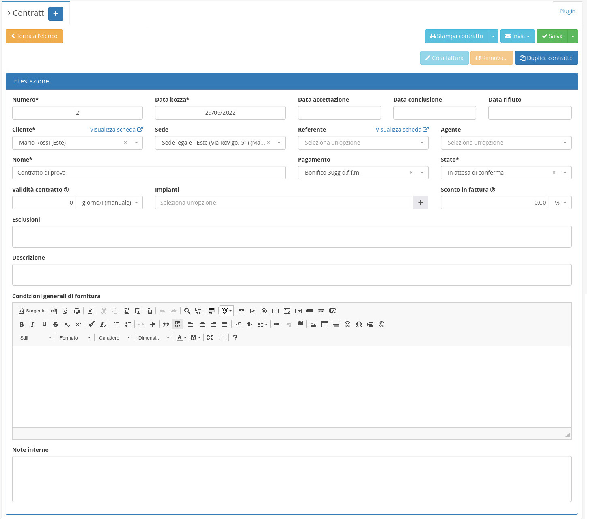

# 🧾 Preventivi


Il modulo **Preventivi** permette di gestire le informazioni relative ai preventivi dell'azienda.


<figure><figcaption></figcaption></figure>

## ➕ Creazione

Per creare un nuovo Preventivo si dovrà cliccare sul tasto (+).

Andranno qui inserite le informazioni relative al nuovo Preventivo:

* Nome
* Cliente
* Sede
* Data bozza
* Sezionale
* Tipo di Attività
* Stato

<figure><figcaption></figcaption></figure>

## 🖌️ Modifica

Cliccando sul record da modificare si aprirà la schermata di dettaglio, da cui sarà possibile modificare:

* Numero
* Date  di bozza, accettazione, conclusione e rifiuto
* Cliente
* Sede
* Referente
* Agente
* Nome
* Metodo di pagamento
* Stato
* Validità offerta
* Tipo di attività
* Tempi di consegna
* Esclusioni
* Garanzia
* Descrizione
* Condizioni generali di fornitura
* Note interne


E' inoltre supportata la gestione dello _Sconto in fattura_ sul netto a pagare del contratto inserendo un valore nel campo **Sconto in fattura** in fase di modifica del documento.


Nelle sezioni successive è invece possibile modificare le righe da inserire a preventivo e gli allegati.

Le righe possono includere:

* Articolo
* Riga generica
* Descrizione
* Sconto/maggiorazione

<figure><figcaption></figcaption></figure>

## 🔧 Plugin


[consuntivo.md](plugin/consuntivo.md)



[revisioni.md](plugin/revisioni.md)



[note-interne.md](../../anagrafiche/plugin/note-interne.md)



[info.md](../../anagrafiche/plugin/info.md)


## 🔽 Informazioni aggiuntive


[azioni-aggiuntive.md](azioni-aggiuntive.md)



[plugin](plugin/)



[Broken link](broken-reference)



[preventivo-consuntivo.md](../../../../guide/videoguide/preventivo-consuntivo.md)

